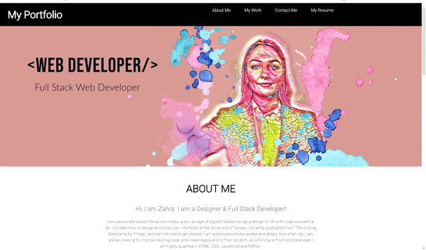

## General Information

The deployed Webpage is my Portfolio to showcase my work, introduce myself and give the user the posibility to contact through multiple channels such as LinkedIn, GitHub, Facebook or Email.

* [Deployed URL of my Portfolio](https://zahramertens.github.io/Portfolio-ZahraMertens/)
* [URL of the GitHub Repo](https://github.com/ZahraMertens/Portfolio-ZahraMertens.git)

## Table if Contents
1. [General Information](#general-informaion)
2. [Task Description](#task-description)
3. [Changes that have been made](#changes-that-have-been-made)
4. [Mock-Up](#mock-up)
5. [Credits](#credits)

## Task Describtion

As a potential employer I want to get an impression of the developer to see project examples and contact information.

The portfolio is supposed to showcase the web developers skills and work that a potential employer or any other user can get an impression of the developers knowledge and qualifications. 

## Actual Behaviour

* WHEN the page loads, the user can see the hero image, a header with a navigation bar and the about-me section.

* WHEN I scrole down, the user can see examples of my work with the featured first project and a contact form to send an email to request a project.

* WHEN I see the footer, it includes possible contact information/ different links to social media platforms of the developer.

* When I click on the featured image of the first Project (CocktailHub), a new tab will open which takes you straight to the deployed webpage. 

* If the user clicks on the green button, a new tab will take the user to the GitHub repository.

* When I go to the slideshow and click on the arrows on the left or right, the user can slide through 5 project examples with a describtion. If the user clicks on the image, he/she will be taken to the deployed webpage and if clicked on the green button it will take you to the GitHub repository.

* WHEN the user goes to the last section of the page, he/she will be presented with a contact form to enter the name, email address and message to send an email to the developer. 

* WHEN the user goes to the footer of the page, he/she is able to go to different social media platforms of the web developer when clicked on the names of the SM platform.

## Mock-Up

The following GIF shows the web applications apperance and functionality:

## Credits

* https://www.w3schools.com/html/
* https://css-tricks.com/snippets/css/a-guide-to-flexbox/#flexbox-properties
* https://coding-boot-camp.github.io/full-stack/github/professional-readme-guide
* https://developer.mozilla.org/en-US/docs/Learn/CSS/Styling_text/Fundamentals
* https://css-tricks.com/snippets/css/style-links-depending-on-destination/
* https://htmlcheatsheet.com/css/
* https://www.w3schools.com/tags/att_a_download.asp